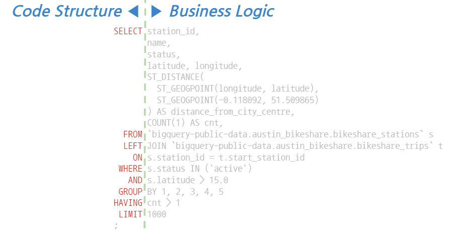

# BigQuery Style Guide
## 목차 (Table of Contents)
- [BigQuery Style Guide](#bigquery-style-guide)
  - [목차 (Table of Contents)](#목차-table-of-contents)
  - [일반 가이드 (_General Guide_)](#일반-가이드-general-guide)
    - [핵심원칙 (_core principle_)](#핵심원칙-core-principle)
    - [공통 스타일 가이드 (_common style guide_)](#공통-스타일-가이드-common-style-guide)
    - [스타일 가이드를 적용한 예시 (_examples_)](#스타일-가이드를-적용한-예시-examples)
  - [이름짓기와 사용하기 (_Naming Conventions_)](#이름짓기와-사용하기-naming-conventions)
    - [명명 기본 가이드](#명명-기본-가이드)
    - [기타 스타일 가이드](#기타-스타일-가이드)
    - [참고 (_references_)](#참고-references)
  - [컬럼 이름 짓기와 사용하기 (_Column Naming_)](#컬럼-이름-짓기와-사용하기-column-naming)
      - [컬럼 이름 기본 가이드](#컬럼-이름-기본-가이드)
      - [접두어와 접미어 (_prefix, suffix_)](#접두어와-접미어-prefix-suffix)
      - [컬럼 별칭 (_column_alias_)](#컬럼-별칭-column_alias)
  - [테이블 이름 짓기와 사용하기 (_Table Naming_)](#테이블-이름-짓기와-사용하기-table-naming)
    - [테이블 이름 기본 가이드](#테이블-이름-기본-가이드)
  - [문장 구조화 하기 (_Statement Structure_)](#문장-구조화-하기-statement-structure)
    - [SELECT 컬럼 리스트](#select-컬럼-리스트)
      - [앞선 쉼표와 뒤따르는 쉼표 (_leading comma vs. trailing comma_)](#앞선-쉼표와-뒤따르는-쉼표-leading-comma-vs-trailing-comma)
      - [컬럼 순서 관례 (_column order conventions_)](#컬럼-순서-관례-column-order-conventions)
    - [FROM 절](#from-절)
      - [영구 테이블 이름과 임시 테이블 이름 (_permanent and temporary table name_)](#영구-테이블-이름과-임시-테이블-이름-permanent-and-temporary-table-name)
      - [서브쿼리 (_subqueries_)](#서브쿼리-subqueries)
    - [WHERE 절](#where-절)
      - [논리 연산자의 혼용 (_mixed logical operators_)](#논리-연산자의-혼용-mixed-logical-operators)
    - [GROUP BY 절](#group-by-절)
    - [공통 테이블 표현식 _Common Table Expressions, CTEs_](#공통-테이블-표현식-common-table-expressions-ctes)
      - [CTE 기본 가이드](#cte-기본-가이드)
    - [JOIN 절](#join-절)
      - [JOIN 기본 가이드](#join-기본-가이드)
      - [상관 크로스 조인 (_correlated cross-join_)](#상관-크로스-조인-correlated-cross-join)
  - [Window Function](#window-function)
    - [윈도우 함수 기본 스타일 가이드](#윈도우-함수-기본-스타일-가이드)
  - [User Defined Function](#user-defined-function)
    - [사용자 정의 함수 스타일 예시](#사용자-정의-함수-스타일-예시)
  - [BigQuery Scripting](#bigquery-scripting)
  - [BigQuery 스타일 예시](#bigquery-스타일-예시)
  - [참고 (_references_)](#참고-references-1)

----
## 일반 가이드 (_General Guide_)

이 문서는 빅데이터를 다루는 엔지니어(data engineer), 데이터 분석가(data analyst)와 데이터 과학자(data scientist)가 BigQuery 언어로 코드 작성시의 지침(guide)과 스타일(style)을 제시하고 있다.

### 핵심원칙 (_core principle_)
- 문장 구조와 코드 스타일의 일관성을 유지하여 가독성이 높은 코드가 되도록 한다.
- 읽기 쉽고 유지보수가 용이한 코드를 최우선으로 한다.
- 중언부언이나 군더더기 없는 간결한 코드가 되도록 힘쓴다.
- 코드만으로 표현하지 못하는 맥락은 주석을 추가하여 이해를 돕는다.

### 공통 스타일 가이드 (_common style guide_)
- 줄바꿈과 들여쓰기를 적절히 사용하여 문장이 의미 단위로 읽힐 수 있도록 만든다.
- 들여쓰기는 탭이 아닌 공백을 이용하며 2칸 들여쓰기를 기본으로 한다.
- 문장(statement)의 각 절(clause)은 새로운 라인에서 시작하며 각 절의 시작 키워드가 오른쪽 정렬이 되도록 한다.
  - `DDL`(Data Definition Language) 문은 예외적으로 왼쪽으로 정렬시킨다.
- 줄바꿈이 지나쳐 좁고 길쭉한 (*skinny*) 구조가 되는 경우 연관된 코드 뭉치를 하나의 라인으로 합칠 수 있다.
- 반대로 한 라인의 길이가 80 글자 내외의 시야 범위를 넘어서는 경우 가로로 지나치게 길어지지 (*flat and wide*) 않도록 줄바꿈을 통해 적절한 폭을 유지한다.
- 언어에서 제공하는 장치들을 이용하여 반복을 최소화한다. **공통 테이블 표현식** `CTE(Common Table Expression)`과 **사용자 정의 함수** `UDF(User Defined Function)` 등은 코드의 모듈화를 돕는 장치들로 중복을 제거하는데 유용하다.

### 스타일 가이드를 적용한 예시 (_examples_)
SQL 문장은 아래와 같이 세분화할 수 있다. 각 문장에 대해 스타일 가이드를 적용한 예시들을 몇가지 살펴보도록 하자.

- `SEL` statement - `SELECT`
- `DDL`(Data Definition Language) statement - `CREATE`, `ALTER`, `DROP`
- `DML`(Data Manipulation Language) statement - `INSERT`, `UPDATE`, `DELETE`, `TRUNCATE`, `MERGE`
- `DCL`(Data Constraint Language) statement - BigQuery에서는 Data Constraint Language 구문를 지원하지 않는다.

`SELECT`는 `DML`의 한 종류이지만 다른 `DML` 문과 달리 테이블의 내용을 변경하지 않는다는 점에서 구분되기도 한다.

- `SELECT` statement 예시

본 가이드는 SELECT 문장의 구조를 구성하는 키워드는 대문자로 오른쪽 정렬을 시키고, 비즈니스 로직은 소문자를 위주로 왼쪽 정렬시켜 문장의 구조(Syntax)와 의미(Semantics)가 구분되도록 하고 있다.

```sql
/* 각 절의 시작 키워드인 SELECT, FROM, LEFT, WHERE, GROUP 등을 오른쪽 정렬 */
SELECT station_id,
       name,
       status,
       latitude, longitude,  -- 연관 컬럼들을 같은 라인에 나열하는 것도 가능
       ST_DISTANCE(
         ST_GEOGPOINT(longitude, latitude), ST_GEOGPOINT(-0.118092, 51.509865)
       ) AS distance_from_city_centre,
       COUNT(1) AS cnt,
  FROM `bigquery-public-data.austin_bikeshare.bikeshare_stations` s
  LEFT JOIN `bigquery-public-data.austin_bikeshare.bikeshare_trips` t
    ON s.station_id = t.start_station_id
 WHERE s.status IN ('active')
   AND s.latitude > 15.0
 GROUP BY 1, 2, 3, 4, 5
HAVING cnt > 1
 LIMIT 1000
;
```

- `DDL` statement 예시

`DDL`문은 `SEL` 문장과 달리 시작 키워드를 왼쪽으로 정렬을 시킨다.

```sql
-- https://cloud.google.com/bigquery/docs/reference/standard-sql/data-definition-language#creating_a_new_table

CREATE TABLE my_dataset.new_table (
  x INT64 OPTIONS (description = 'An optional INTEGER field'),
  y STRUCT<
    a ARRAY<STRING> OPTIONS (description = 'A repeated STRING field'),
    b BOOL
  >,
)
PARTITION BY _PARTITIONDATE
OPTIONS (
  expiration_timestamp = TIMESTAMP '2025-01-01 00:00:00 UTC',
  partition_expiration_days = 1,
  description = 'a table that expires in 2025, with each partition living for 24 hours',
  labels=[("org_unit", "development")]
)
;
```
```sql
-- https://cloud.google.com/bigquery/docs/reference/standard-sql/data-definition-language#examples_6

ALTER TABLE mydataset.mytable
SET OPTIONS (
      expiration_timestamp = TIMESTAMP_ADD(CURRENT_TIMESTAMP(), INTERVAL 7 DAY),
      description = "Table that expires seven days from now"
    )
;
```

- `DML` statement 예시

```sql
-- https://cloud.google.com/bigquery/docs/reference/standard-sql/dml-syntax#insert_using_explicit_values

INSERT dataset.Inventory (
         product,
         quantity
       )
VALUES ('top load washer', 10),
       ('front load washer', 20),
       ('dryer', 30),
       ('refrigerator', 10),
       ('microwave', 20),
       ('dishwasher', 30),
       ('oven', 5)
;
```
```sql
-- https://cloud.google.com/bigquery/docs/reference/standard-sql/dml-syntax#update_using_joins

UPDATE dataset.Inventory
   SET quantity = quantity + (
         SELECT quantity
           FROM dataset.NewArrivals
          WHERE Inventory.product = NewArrivals.product
       ),
       supply_constrained = false
 WHERE product IN (SELECT product FROM dataset.NewArrivals)
;

UPDATE dataset.Inventory i
   SET quantity = i.quantity + n.quantity,
       supply_constrained = false
  FROM dataset.NewArrivals n
 WHERE i.product = n.product
;
```

```sql
-- https://cloud.google.com/bigquery/docs/reference/standard-sql/dml-syntax#merge_examples

MERGE dataset.DetailedInventory T
USING dataset.Inventory S
   ON T.product = S.product
 WHEN NOT MATCHED AND quantity < 20 THEN
      INSERT (product, quantity, supply_constrained, comments)
      VALUES (
        product, quantity, true,
        ARRAY<STRUCT<created DATE, comment STRING>>[
          (DATE('2016-01-01'), 'comment1')
        ]
      )
 WHEN NOT MATCHED THEN
      INSERT (product, quantity, supply_constrained)
      VALUES (product, quantity, false)
```

----
## 이름짓기와 사용하기 (_Naming Conventions_)

이 장에서는 문장을 이루는 가장 기본적인 단위인 키워드와 식별자 이름에 대한 내용을 다룬다.

### 명명 기본 가이드

식별자(_identifier_)는 문장내에서 유일하게 구별되어 인식되는 이름으로 아래 항목들을 포함한다.
1. 언어의 문법구조를 기술하는 토큰(_token_) - ex. `SELECT`, `JOIN`, `FROM`, ...
2. 테이블, 컬럼의 명칭이나 별칭(_alias_)
3. 기본 제공 함수 또는 사용자 정의 함수 이름 - ex. `SUM()`, `STRPOS()`, ...

[키워드(_keyword_)](https://cloud.google.com/bigquery/docs/reference/standard-sql/lexical#reserved_keywords) 는 예약된 식별자(_reserved identifier_) 로서 SQL 명세에 의해 그 쓰임이 이미 정해져 있는 이름을 말한다.

본 가이드에서는 아래 서술된 관례에 따라 이름을 정의하고 표기하는 것을 권장한다.
- 키워드는 대문자로 그 외의 식별자는 소문자로 작성하도록 한다.
- 여러 단어로 이루어진 식별자는 `camelCase`가 아닌 `snake_case`의 형태로 작성토록 한다.
- 기본 제공 함수 혹은 내장 함수(_built-in function_)는 대소문자를 구분하지 않으나 대문자로 작성하는 것을 기본으로 한다.
- 사용자 정의 함수(UDF, _user-defined function_)는 소문자를 사용하여 함수 이름을 정의하도록 한다. UDF 이름은 대소문자를 구분한다.

위의 관례에 따른 예시는 다음과 같다.

:smile: 권장 (_recommend_)
```sql
SELECT first_name, last_name FROM my_dataset.my_table
```
:disappointed: 기피 (_avoid_)
```sql
select firstName, lastName from myDataset.myTable -- camel case 사용
-- OR
SELECT FIRST_NAME, LAST_NAME FROM MY_DATASET.MY_TABLE
```

내장 함수와 달리 사용자 정의 함수의 이름에 소문자를 사용하는 이유는 다음과 같다.

사용자 정의 함수를 영속 함수 (_persistent function_) 로 정의하는 경우 데이터셋 이름을 포함한 **한정된 함수 이름** (_qualified function name_)을 사용해야 한다.  이때 함수를 한정시키기 위해 사용하는 프로젝트 이름이나 데이터셋의 이름이 소문자로 작성되기 때문에 하나의 의미 단위내에서 대소문자가 혼용되지 않게 하기 위해서이다.

이를 통해 아래에 설명할 **FQTN (Fully Qualified Table Name)** 테이블 이름 규칙과의 일관성도 유지할 수 있다.

```sql
-- 완전 한정된 함수 이름의 예 - fully qualified function name
SELECT bqutils.fn.last_day('2021-03-07')
```

대소문자의 구분은 문장내에서 각 이름이 제 역할을 드러내도록 하는데 도움을 준다.

대문자 `SELECT`, `FROM` 등의 키워드는 주로 문장 구조의 표현에 사용되는데 소문자로 표기되는 개체(_entity_)나 속성(_attribute_)의 식별자 이름과 시각적으로 구분이 된다. 이는 전체적인 문장 구조의 파악을 용이하게 한다.

### 기타 스타일 가이드
- 키워드가 부득이하게 컬럼의 이름으로 사용되는 경우 backtick(`)을 이용하여 감싸준다 (_quoted identifiers_).
```sql
-- from 예약어가 컬럼명으로 사용하는 경우
SELECT 'asia-northeast3' AS `from` FROM ...
```
- 문자열 리터럴(_string literal_)은 작은따옴표(')를 사용한다.
- 상수(_constant_)값을 갖는 변수 이름은 대문자로 한다.

```sql
DECLARE START_DATE DATE DEFAULT '2021-02-19'
```

### 참고 (_references_)
- [Lexical structure and syntax in Standard SQL](https://cloud.google.com/bigquery/docs/reference/standard-sql/lexical)

----
## 컬럼 이름 짓기와 사용하기 (_Column Naming_)

#### 컬럼 이름 기본 가이드
컬럼이름은 `camelCase`가 아닌 소문자를 이용하여 `snake_case` 로 표현하며 [헝가리언 표기](https://en.wikipedia.org/wiki/Hungarian_notation) 나 의미를 유추하기 힘든 지나치게 축약된 접두어(_prefix_), 접미어(_suffix_)의 사용은 자제한다.

기준정보와 같이 팀내에서 표준으로 관리되는 속성들이 있는 경우에는 해당 표준에서 정의된 명명규칙을 우선한다. 예를 들어, 국가코드등 기준정보로 사용되는 컬럼의 이름은 표준에서 정의된 명명 규칙을 차용해서 사용하도록 한다.
```sql
SELECT cnty_cd, mcc, mnc, csc, FROM ...
```

배열형이나 복수의 의미를 지니는 컬럼인 경우는 이름을 복수형으로 할 수 있다.

```sql
SELECT hits,          -- ARRAY<STRUCT<>> 형
       totals.visits, -- INT64형, 총 세션 횟수
       totals.hits,   -- INT64형, 세션내 조회수
  FROM `bigquery-public-data.google_analytics_sample.ga_sessions_20170801`
;
```

#### 접두어와 접미어 (_prefix, suffix_)
접두어나 접미어는 이름에 부가적인 의미(semantics)를 부여하기 위한 목적으로 사용 가능하나 지나치게 축약된 약어나 과도한 사용은 오히려 가독성을 떨어뜨릴 수 있어 사용에 신중해야 한다.

아래는 몇가지 사용 가능한 예시이다.

- Boolean 형의 경우 `is_`, `has_`와 같은 접두어를 사용할 수 있다.
- Date형은 `_dt` 접미어를 붙일 수 있다.
- DateTime이나 Timestamp형은 `_at` 접미어가 가능하다.
- `user_id`, `device_id` 처럼 식별자(_id_) 접미어의 사용이 가능하다.

```sql
SELECT is_active,
       registered_dt,
       updated_at,
  FROM ...
```

#### 컬럼 별칭 (_column_alias_)
컬럼의 별칭 이름은 컬럼 이름 기본 가이드에 준하여 작성한다. 별칭 앞의 `AS` 키워드 는 생략 가능하나 본 가이드에서는 명시적으로 사용하는 것을 기본으로 한다.

별칭은 목적에 따라서 컬럼 이름보다 상세히 작성되는 경우도 있고 반대로 간략하게 축약된 형태로 사용하기도 한다.

컬럼의 의미를 명확히 하기 위해서 아래와 같이 긴 이름의 별칭을 사용할 수 있다.

```sql
SELECT fname AS first_name,
       lname AS last_name,
  FROM ...
```

반면에 컬럼 이름이 유도된 컬럼(_derived column_) 또는 계산된 컬럼(_calculated column_)을 만들어 내는 연산식에서 반복적으로 사용되어지는 경우는 간결함을 위해서 축약된 이름을 사용하기도 한다.

:disappointed: 기피 (_avoid_)
```sql
WITH locations AS (
  SELECT x_position,
         y_position,
         city_centre_x_position,
         city_center_y_position,
    FROM ...
)
SELECT SQRT(
         (city_center_x_position - x_position) * (city_center_x_position - x_position) +
         (city_center_y_position - y_position) * (city_center_y_position - y_position)
       ) AS distince,  -- calculated(or derived) column
  FROM locations
```
위의 예시는 테이블이 가지는 기본 컬럼 (_base column_) 으로부터 새로운 컬럼을 파생시키는 연산식에 컬럼 이름이 반복적으로 등장하여 라인이 길어지고 있다. 이를 아래와 같이 축약된 별칭을 사용하여 연산식을 간결하게 표현할 수 있다.

:smile: 권장 (_recommend_)
```sql
WITH location AS (
  SELECT x_position AS x,
         y_position AS y,
         city_centre_x_position AS cx,
         city_center_y_position AS cy,
    FROM ...
)
SELECT SQRT((cx - x) * (cx - x) + (cy - y) * (cy - y)) AS distince,
  FROM location
```

----
## 테이블 이름 짓기와 사용하기 (_Table Naming_)

### 테이블 이름 기본 가이드
테이블 이름은 소문자 사용을 기본으로 하되 영구 테이블(_permanent table_)에 대한 팀내 명명 규칙이 별도로 정해져 있는 경우 그것을 우선한다.

다만, 임시테이블(_temporary table_)이나 공통 테이블 표현식(_CTEs_) 이름의 경우는 소문자를 사용하도록 한다. 테이블 이름은 대소문자를 구분한다.

- 여래 개의 단어를 조합하여 이름를 지을 경우 dash(-)가 아닌 underscore(_)를 사용하여 snake_case 이름이 되도록 한다.
- 과제별 명명규칙에 의해 이미 생성되어 운영되고 있는 데이터셋과 테이블 이름들은 가이드의 권고를 따르지 않더라도 As-Is 이름을 그대로 사용토록 한다.

■ Fully Qualified Table Name (FQTN)

> '_완전하게 한정된 테이블 이름_ 또는 _정규화된 테이블 이름_'의 의미는 그 이름을 가지고 실행컨텍스트와 상관없이 유일하게 테이블를 특정할 수 있다는 말이다.
> 예를 들어,  `customer.devices` 라는 _일부 한정된 테이블 이름_ 을 사용하는 경우 쿼리가 실행되는 프로젝트에 따라 각기 다른 `customer.devices` 테이블에 접근될 수 있다.

BigQuery로 DWH(Data Ware House)를 구축하는 경우 데이터가 저장된 프로젝트와 BigQuery Job을 실행시켜주는 프로젝트가 다를 수 있기 때문에 실행컨텍스트의 영향을 받지 않도록 정규화된 형태의 테이블 이름을 사용하도록 한다. 테이블 이름에 프로젝트 명을 생략하는 경우 BigQuery Job 이 수행되고 있는 프로젝트 이름을 암묵적으로 사용한다.

이외에, 단일 문장(_single statement_)의 쿼리를 실행하는 경우가 아닌 BigQuery 스크립트(_script_)로 복수의 문장(_multiple statements_)을 실행하는 경우에는 GCP Project 이름에 포함된 dash(-)가 뺄셈 등의 다른 의미로 해석이 되지 않도록 _정규화된 테이블 이름_ 을 backtick(`)을 사용하여 감싸준다.

이때 dash가 포함된 프로젝트 이름만 backtick으로 감싸주어도 오류가 발생하지는 않으나 FQTN 전체를 backtick을 감싸주어 의미적으로 하나의 단위임을 명시적으로 나타내도록 한다.

:smile: 권장 (_recommend_)
```sql
SELECT * FROM `bigquery-public-data.austin_bikeshare.bikeshare_stations`
```
:disappointed: 기피 (_avoid_)
```sql
SELECT * FROM `bigquery-public-data.austin_bikeshare`.bikeshare_stations
-- or
SELECT * FROM `bigquery-public-data.austin_bikeshare`.`bikeshare_stations`
-- or
SELECT * FROM `bigquery-public-data`.`austin_bikeshare`.`bikeshare_stations`
```

별표(`*`)를 포함하는 와일드카드(_wildcard_) 테이블 이름도 backtick(`)으로 감싸주어야 한다.

```sql
/* Valid standard SQL query with wildcard table name*/
SELECT max
  FROM `bigquery-public-data.noaa_gsod.gsod*`
 WHERE max != 9999.9 # code for missing data
   AND _TABLE_SUFFIX = '1929'
 ORDER BY max DESC
;
```

■ 주의

테이블 이름이 따옴표로 묶인 식별자(quoted identifier)인 경우 참조(reference)시 묶음 단위로 사용해야 한다. 여러 테이블을 다루는 JOIN 구문에서 아래와 같이 테이블을 참조할 경우 에러가 발생한다.

```sql
-- Error
SELECT *
  FROM `bigquery-public-data.austin_bikeshare.bikeshare_stations`
  JOIN `bigquery-public-data.san_francisco.bikeshare_trips`
    ON bikeshare_stations.station_id = bikeshare_trips.start_station_id
```
>Unrecognized name: bikeshare_stations

이는 FQTN 전체가 따옴표로 묶인 식별자여서 하나의 묶음으로 참조되어야 하고 묶음 안의 테이블 이름을 따로 꺼내 사용할 수 없기 때문이다.

FQTN 전체를 참조하는 아래 쿼리는 정상 수행되나 보기에 좋은 코드는 아니다.

```sql
-- working but looks ugly
SELECT *
  FROM `bigquery-public-data.austin_bikeshare.bikeshare_stations`
  JOIN `bigquery-public-data.san_francisco.bikeshare_trips`
    ON `bigquery-public-data.austin_bikeshare.bikeshare_stations`.station_id =
       `bigquery-public-data.san_francisco.bikeshare_trips`.start_station_id
```

이런 경우 테이블 별칭(alias)를 사용하여 따옴표로 묶인 FQTN 이 아닌 별칭을 참조하도록 하여 테이블 이름 짓기 지침을 따르면서도 간결함을 유지할 수 있다.
```sql
SELECT *
  FROM `bigquery-public-data.austin_bikeshare.bikeshare_stations` s
  JOIN `bigquery-public-data.san_francisco.bikeshare_trips` t
    ON s.station_id = t.start_station_id
```
----
## 문장 구조화 하기 (_Statement Structure_)

SQL 문법에 정의된 키워드들과 앞서의 명명 규칙에 의해 지어진 이름을 사용하여 각 구절을 기술하고 이를 블럭처럼 쌓아 문장으로 구조화해 보도록 한다.

### SELECT 컬럼 리스트
SQL의 가장 기본적인 `SELECT` 문장의 컬럼 리스트는 아래의 지침에 따라 작성한다.
- `SELECT` 리스트에 등장하는 컬럼이 복수개일 경우 한 라인에 하나씩 작성하는 것을 기본으로 한다.
- `SELECT *` 로 전체 컬럼을 가져오기 보다는 필요한 컬럼만을 `SELECT` 리스트에 열거하도록 한다.

```sql
SELECT station_id,
       name,
       status,
       latitude,
       longitude,
  FROM `bigquery-public-data.austin_bikeshare.bikeshare_stations`
```
- 일부 컬럼을 제외한 전체 컬럼이 필요한 경우는 **EXCEPT** 구문을 활용한다.
```sql
SELECT * EXCEPT(latitude, longitude)
  FROM `bigquery-public-data.austin_bikeshare.bikeshare_stations`
```

- 의미적으로 관련이 있거나 시야 범위내에서 한 눈에 읽히고 이해될 수 있다면 80자를 넘지 않는 선에서 하나의 라인에 복수의 컬럼들을 기술할 수 있다.
- 주석을 사용하여 컬럼의 의미를 부연 설명할 수 있다.
- 마지막 컬럼명의 뒤에 콤마(,)를 추가한다.

```sql
SELECT station_id,
       name,
       status,
       latitude, longitude,  -- 하나의 컬럼 뭉치(Column Family)로 의미적으로 묶임
  FROM `bigquery-public-data.austin_bikeshare.bikeshare_stations`
;
-- 또는
SELECT station_id, name, status, latitude, longitude,
  FROM `bigquery-public-data.austin_bikeshare.bikeshare_stations`
;
```
- 컬럼 별칭(alias)을 포함하는 경우에도 위의 내용들이 동일하게 적용된다.
- 컬럼 별칭은 `AS` 키워드 다음에 위치시키며 별칭의 시작 위치는 따로 정렬시키지 않는다.

:smile: 권장 (_recommend_)
```sql
SELECT station_id AS station_id,
       name AS station_name,
       status AS bike_status,
       latitude,
       longitude,
  FROM `bigquery-public-data.austin_bikeshare.bikeshare_stations`
```
:disappointed: 기피 (_avoid_)
```sql
SELECT station_id         AS station_id,
       name               AS station_name,
       status             AS bike_status,
       latitude,
       longitude,
  FROM `bigquery-public-data.austin_bikeshare.bikeshare_stations`
```

#### 앞선 쉼표와 뒤따르는 쉼표 (_leading comma vs. trailing comma_)
BigQuery에서는 `SELECT` 리스트의 마지막 컬럼 뒤에 콤마(,)를 허용하기 때문에 본 가이드에서는 뒤따르는 쉼표를 사용한다.

:smile: 권장 _recommend_
```sql
SELECT station_id,
       name,
       status,
       latitude,
       longitude,  -- 마지막 컬럼 뒤 콤마(,) 추가
  FROM `bigquery-public-data.austin_bikeshare.bikeshare_stations`
```
:disappointed: 기피 _avoid_
```sql
SELECT station_id
     , name
     , status
     , latitude
     , longitude
  FROM `bigquery-public-data.austin_bikeshare.bikeshare_stations`
```

뒤따르는 쉼표를 지원하지 않는 SQL 언어에서는 앞선 쉼표를 사용해서 SELECT 리스트에 새로운 컬럼을 추가해도 직전 라인에 영향을 주지 않도록 하였으나 BigQuery에서는 뒤따르는 쉼표를 지원하므로 이를 기본 스타일로 삼는다.

```sql
-- 뒤따르는 쉼표 사용
SELECT station_id,
       name
  FROM ...

-- 컬럼 추가시
SELECT station_id,
       name,    -- 아래 때문에 comma가 추가됨.
       status   -- 신규컬럼 추가
  FROM ...
```

```sql
-- 앞선 쉼표 사용
SELECT station_id
     , name
  FROM ...

-- 컬럼 추가시
SELECT station_id
     , name     -- 아래 컬럼 추가로 변경되는 내용이 없음
     , status   -- 신규컬럼 추가
  FROM ...
```

이외에 범용 프로그래밍 언어나 동적(_dynamic_) SQL을 사용하여 `SELECT` 문의 컬럼 리스트를 자동 생성할 때 뒤따르는 쉼표를 사용할 경우 리스트의 마지막 컬럼에 쉼표가 생략되도록 예외 처리할 필요가 없어 구현 로직이 단순해지는 장점이 있다.

#### 컬럼 순서 관례 (_column order conventions_)
- 기본키(PK, Primary Key)에 해당하는 컬럼명을 먼저 위치시킨다.
- (optional) 파티션된 테이블 사용시 파티션 컬럼명은 마지막에 위치시킨다. 운영중에 스키마 변경으로 인한 컬럼 추가시는 예외가 된다.
- `GROUP BY` 를 동반한 집계 쿼리에서는 차원(dimension)에 해당하는 컬럼명을 먼저 나열한 후 지표(metric)에 해당하는 컬럼명을 기술한다.

### FROM 절
`FROM` 절에는 테이블 또는 이에 상응하는 서브쿼리가 위치하게 된다. 서브쿼리에 대한 대한 스타일은 다음 장에서 다시 언급하도록 한다.

- `FROM` 절은 `SELECT` 리스트의 다음 라인에 위치하며 테이블 이름, 서브쿼리 혹은 **UNNEST**와 같은 테이블 함수 이름이 `FROM` 키워드에 이어 작성된다.
- `FROM` 키워드는 `SELECT` 키워드에 오른쪽 정렬(right-aligned)이 되도록 위치시킨다.

#### 영구 테이블 이름과 임시 테이블 이름 (_permanent and temporary table name_)
- `FROM` 키워드 다음에 등장하는 테이블 이름으로는 영구 테이블(_permanent table_)과 임시 테이블(_temporary table_) 이름 또는 CTE(_common table expression_) 구문에 의해 정의된 이름을 사용할 수 있다.
- 영구 테이블 이름은 `FQTN` 형식을 사용하며 임시 테이블이나 CTE 이름은 `snake_case` 형식을 사용한다.
- 임시 테이블이나 CTE 이름은 테이블의 사용목적이 명확히 들어나도록 작성한다.

``` sql
-- Permanent Table
SELECT *
  FROM `bigquery-public-data.austin_bikeshare.bikeshare_stations`;
```
```sql
-- Temporara Table (ex. CTAS 구문으로 임시테이블 생성)
CREATE TEMP TABLE tmp_table AS SELECT ... ;

SELECT * FROM tmp_table;
```
```sql
-- CTEs - named subquery
WITH cte_name AS ( -- snake_case 규칙에 따라 기술
  SELECT ... -- 왼쪽 두칸 들여쓰기를 한다.
    FROM ...
)
SELECT * FROM cte_name;
```

#### 서브쿼리 (_subqueries_)
테이블 이름이나 CTE 이름이 서브쿼리를 사용하여 `FROM` 절을 구성할 경우에 아래와 같이 다양한 스타일이 가능하다.  이 가이드에서는 `from_style_#2` 를 사용한 구성을 권장한다.


:disappointed: 기피 (_avoid_)
``` sql
-- 테이블 서브쿼리 스타일 #1 (from_style_#1)
SELECT *
  FROM (SELECT station_id,
               name,
               status
          FROM `bigquery-public-data.austin_bikeshare.bikeshare_stations`)
```
:smile: 권장 (_recommend_)
```sql
-- 테이블 서브쿼리 스타일 #2 (from_style_#2)
SELECT *
  FROM (
    SELECT station_id, -- FROM 키워드로부터 두 칸 들여쓰기
           name,
           status,
      FROM `bigquery-public-data.austin_bikeshare.bikeshare_stations`
  ) -- 닫는 괄호는 쌍이 되는 여는 괄호의 키워드 시작점과 라인을 맞춘다.
```

본 가이드에서 `from_style_#2` 를 선호하는 이유는 아래와 같다. 우선 위의 쿼리를 `JOIN`을 이용하여 확장해 보도록 하자.

``` sql
/* JOIN을 이용하여 쿼리를 확장한 예시 */
-- 테이블 서브쿼리 스타일 #1 (from_style_#1)
SELECT *
  FROM (SELECT station_id,
               name,
               status
          FROM `bigquery-public-data.austin_bikeshare.bikeshare_stations`) AS a
  LEFT JOIN (SELECT station_id,
                    name,
                    status
               FROM `bigquery-public-data.austin_bikeshare.bikeshare_stations`) AS b
    ON a.station_id = b.station_id
;
-- 테이블 서브쿼리 스타일 #2 (from_style_#2)
SELECT *
  FROM (
    SELECT station_id,
           name,
           status,
      FROM `bigquery-public-data.austin_bikeshare.bikeshare_stations`
  ) AS a
  LEFT JOIN (
    SELECT station_id,
           name,
           status,
      FROM `bigquery-public-data.austin_bikeshare.bikeshare_stations`
  ) AS b
    ON a.station_id = b.station_id
;
 ```
`from_style_#1` 은 동일한 수준(level or depth)에 위치한 두 서브쿼리 `a`, `b`의 들여쓰기가 서로 달라져 있다. 반면에 `from_style_#2` 은 두 서브쿼리가 동일한 들여쓰기를 유지하면서 동시에 테이블 별칭(alias)을 라인의 끝이 아닌 앞쪽에 위치함으로써 `ON`절에서 시선을 크게 이동시키지 않고서도 확인 가능하다.

### WHERE 절
`WHERE` 절에는 `FROM` 절의 결과를 필터링하기 위한 조건을 기술한다. `WHERE` 절은 아래의 가이드에 따라 작성한다.

- 비교 연산자의 앞 뒤로 공백을 두도록 한다.
- 비동등연산자는 `!=`와 `<>` 모두 사용가능하다. [SQL-1999](http://web.cecs.pdx.edu/~len/sql1999.pdf)에서는 `<>`를 표준으로 정의하고 있다.
- 조건절은 `AND`와 `OR` 논리 연산자에 의해 복수개가 연결(_chaining_)될 수 있다.
- 복수개의 조건을 기술하는 경우는 하나의 라인에 하나의 조건을 기술하는 것을 기본으로 하되 연관된 조건의 경우에는 80자를 넘지 않는 선에서 하나의 라인에 같이 작성 가능하다.
- `AND`와 `OR` 논리 연산자는 `WHERE` 키워드에 오른쪽 정렬이 되도록 한다.  단, 혼용되어 사용되는 경우는 [논리 연산자의 혼용 (_mixed logical operators_)](#논리-연산자의-혼용-mixed-logical-operators) 가이드를 따른다.
- `BETWEEN`이나 `IN` 연산자를 사용하여 복수개의 조건을 묶을 수 있는 경우는 연산자를 사용하여 조건을 간결하게 표현한다.

```sql
SELECT station_id,
       name,
       status,
       latitude, longitude,
  FROM `bigquery-public-data.austin_bikeshare.bikeshare_stations`
 WHERE status = 'active'
   AND latitude > 135.0   -- AND 로 조건 연결
;
```

#### 논리 연산자의 혼용 (_mixed logical operators_)
테이블 조회시 `AND`와 `OR`를 혼용하여 사용하는 경우에는 아래의 가이드에 따라 코드를 구조화한다.

1. 주어진 테이블에서 `AND` 조건으로 결과셋(_result set_)을 줄여나가는지 반대로 `OR` 조건으로 대상을 늘려나가는지를 보고 최상위 조건절의 구조를 먼저 파악한다.
2. 각 상위 조건들이 다시 세부적인 조건으로 나뉘는 경우에 괄호를 이용하여 해당 세부조건을 묶는다. 괄호를 통해서 연산자 우선순위에 따른 부작용(_side effect_)을 없앤다.
3. 세부 조건에 등장하는 `AND` 또는 `OR` 연산자는 라인의 끝에 위치시키도록 한다.
4. 3 단계 이상의 깊이에서 논리연산이 이루어지는 경우 분배 법칙을 이용하여 깊이를 낮출 수 있다.

```sql
-- 최상위 조건들을 AND로 묶고 세부조건이 OR로 묶이는 경우
SELECT station_id,
       name,
       status,
       latitude, longitude,
  FROM `bigquery-public-data.austin_bikeshare.bikeshare_stations`
 WHERE status = 'active'
   AND (latitude > 135.0 OR
        longitude > 80.0)
   AND ...
;
-- 또는, 최상위 조건들을 OR로 묶고 세부조건을 AND로 묶는 경우
SELECT station_id,
       name,
       status,
       latitude, longitude,
  FROM `bigquery-public-data.austin_bikeshare.bikeshare_stations`
 WHERE status = 'active'
    OR (latitude > 135.0 AND longitude > 80.0) -- 의미단위로 묶어서 한 줄에 표현
    OR ...
```
```sql
SELECT *
  FROM `bigquery-public-data.austin_bikeshare.bikeshare_stations`
 WHERE status = 'active'
    OR (latitude > 135.0 AND (longitude = 80.0 OR longitude = 90.0))
    OR ...
-- 위에서와 같이 3 단계 이상의 깊이에서 논리연산 이루어지는 경우 분배법칙을 이용하여 아래와 같이 결과적으로 동치인 문장으로 풀어쓸 수 있다. a · (b + c) = (a · b) + (a · c)
 WHERE status = 'active'
    OR (latitude > 135.0 AND longitude = 80.0)
    OR (latitude > 135.0 AND longitude = 90.0)
    OR ...
```

### GROUP BY 절

- 집계함수에 의해서 만들어지는 지표(metric) 컬럼은 별칭(alias)를 사용하여 익명(_anonymous_)이 아닌 이름을 부여한다.
- `GROUP BY` 리스트에는 컬럼의 별칭이나 컬럼 순서(ordinal position)를 사용할 수 있으므로 컬럼 순서를 우선해서 사용하도록 한다.
- 특히, 기본컬럼에서 `CASE`문 등으로 계산된 컬럼(calculated column)이 차원으로 사용되는 경우에는 반드시 별칭이나 컬럼 순서를 사용하여 코드가 반복되어 사용되지 않도록 한다.
- `HAVING` 은 집계결과를 필터링하기 위한 집계값의 조건을 기술하는 구문으로 **ORDER BY** 에서와 같이 컬럼 별칭 사용이 가능하다.

```sql
SELECT station_id,
       name AS station_name,
       status,
       CASE
         WHEN ST_DISTANCE (
                ST_GEOGPOINT(longitude, latitude),
                ST_GEOGPOINT(-0.118092, 51.509865)
              ) < 7000000 THEN 'downtown'
         ELSE 'outskirt'
       END AS downtown_or_outskirt,
       COUNT(1) AS cnt,    -- 집계함수에 의해 계산된 metric 컬럼에 별칭 부여
  FROM `bigquery-public-data.austin_bikeshare.bikeshare_stations`
 WHERE s.status IN ('active')
   AND s.latitude > 135.0
 GROUP BY 1, 2, 3  -- ordinal position
HAVING cnt > 1 -- column alias
;
```

아래 예시처럼 `SELECT` 리스트에 계산된 컬럼을 정의하고 해당 컬럼을 차원으로 `GROUP BY` 집계를 하는 경우 `GROUP BY` 리스트에서 코드가 반복되어 문장이 길어지고 향후 유지보수가 어려워지게 된다.

:smile: 권장 (_recommend_)
```sql
SELECT CASE
         WHEN is_male = TRUE THEN 'Male'
         WHEN is_male = FALSE THEN 'Female'
       END AS gender,
       COUNT(1) AS cnt,
  FROM `bigquery-public-data.samples.natality`
 GROUP BY 1
HAVING cnt > 1000
;
```

:disappointed: 기피 (_avoid_)
```sql
SELECT CASE
         WHEN is_male = TRUE THEN 'Male'
         WHEN is_male = FALSE THEN 'Female'
       END,
       COUNT(1) AS cnt,
  FROM `bigquery-public-data.samples.natality`
 GROUP BY
       CASE
         WHEN is_male = TRUE THEN 'Male'
         WHEN is_male = FALSE THEN 'Female'
       END
;
```

또한, 계산된 컬럼을 지표로 사용하여 집계를 수행하는 경우에 컬럼 이름과 별칭을 혼동하여 사용할 경우 아래와 같이 원치 않는 결과가 만들어질 수 있으니 주의가 필요하다.

```sql
DECLARE data ARRAY<STRUCT<region STRING,  amount INT64>> DEFAULT [
    ('', 1), ('NULL', 2), ('KOR', 2), ('USA', 3), ('KOR', 4), ('CHN', 1)
];

SELECT IF(d.region IN ('', 'NULL'), 'UNKNOWN', d.region) AS rgn,
       SUM(d.amount) AS totals,
  FROM UNNEST(data) d GROUP BY region; -- 별칭이 아닌 컬럼 이름을 사용하여 그룹핑
```

| 행 |	rgn |	totals |
|---|:---:|---:|
| 1	| UNKNOWN | 1 |
| 2	| UNKNOWN | 2 |
| 3	| KOR | 6 |
| 4	| USA | 3 |
| 5	| CHN | 1 |

<br>

### 공통 테이블 표현식 _Common Table Expressions, CTEs_
Common Table Expression 은 서브 쿼리에 이름을 부여하여 참조할 수 있도록 하는 표현방식이다. 서브쿼리에 이름을 부여한 **Named Subquery** 인 셈이다.

서브쿼리는 정의된 해당 위치에서만 참조 가능하지만, 공통 테이블 표현식은 문장 내 여러 곳에서 반복적으로 참조될 수 있다.

CTE는 복잡한 쿼리 구조를 간결하게 재구성하는데 핵심적인 역할을 한다.

#### CTE 기본 가이드
코드 내에 2단계를 넘어 중첩되는 서브쿼리가 존재하는 경우에는 서브쿼리를 CTE 구문으로  대체하여 전체 쿼리 구조가 적절한 깊이(2 depth)를 유지 하도록 한다.

CTE는 테이블 서브쿼리(_table subquery_)외에도 스칼라 서브쿼리(_scalar subquery_)를 대체하여 코드를 간결하게 만드는데도 유용하다.

아래의 예시에서는 2단계 이상 중첩된 서브쿼리를 CTE 구문을 사용하여 코드의 깊이가 한 단계가 되도록 하고 있다. 이후 단계별 중간 테이블 역시 CTE로 정의하여 사용하면서 최종적으로는 동일한 결과를 만들어내게 된다.

:disappointed: 기피 _avoid_
```sql
SELECT *
  FROM (
    SELECT *
      FROM (
        SELECT *
          FROM base_table
      ) AS first_subquery
  ) AS second_subquery
```

:smile: 권장 _recommend_
```sql
WITH first_subquery (  -- 가장 안쪽의 서브쿼리
SELECT *
  FROM base_table
),
second_subquery ( -- 상위 서브쿼리
  SELECT *
    FROM first_subquery
)
SELECT *  -- 메인 쿼리
  FROM second_subquery
;
```

`FROM` 절에 직접 서브쿼리를 사용하는 경우 아래쪽에 위치한 서브쿼리를 먼저 읽고 다시 위쪽의 쿼리를 읽어야 하는 반면, CTE를 사용하는 경우는 위에서부터 자연스럽게 아래로 코드 읽기가 가능한 장점이 있다.

아래는 CTEs를 이용하여 계산된 컬럼이 반복되지 않도록 구조를 변경한 예시이다. 중복은 코드 길이를 증가시키고 유지보수를 어렵게 하기 때문에 서브쿼리나 CTE를 이용하여 코드가 반복되지 않도록 만드는 것이 좋다.

:disappointed: 기피 (_avoid_)
```sql
SELECT name AS station_name,
       ST_DISTINCE (
         ST_GEOPOINT(longitude, latitude), ST_GEOPOINT(-0.118092, 51.509865)
       ) AS distance_from_city_centre_m
  FROM `bigquery-public-data.london_bicycles.cycle_stations`
 WHERE ST_DISTINCE (
         ST_GEOPOINT(longitude, latitude),
         ST_GEOPOINT(-0.118092, 51.509865)
       ) <= 500
 ORDER BY distance_from_city_centre_m
```

:smile: 권장 (_recommend_)
```sql
WITH stations (
  SELECT name AS station_name,
         ST_DISTINCE (
           ST_GEOPOINT(longitude, latitude), ST_GEOPOINT(-0.118092, 51.509865)
         ) AS distance_from_city_centre_m
    FROM `bigquery-public-data.london_bicycles.cycle_stations`
)
SELECT *
  FROM stations
 WHERE distance_from_city_centre_m <= 500
 ORDER BY distance_from_city_centre_m
```

### JOIN 절

#### JOIN 기본 가이드
- `INNER`와 `OUTER` 키워드는 생략되더라도 의미적으로 혼동을 주지 않기 때문에 생략한다. 내부조인은 `JOIN`, 외부조인은 `LEFT JOIN`, `OUTER JOIN`을 사용한다.
- Cartesian Product는 `CROSS JOIN` 사용한 조인 형식을 콤마(,)를 사용한 오라클 조인 형식 보다 우선한다. 다만, 아래에서 언급할 상관 크로스 조인 (_correlated cross-join_)의 경우는 콤마 조인 형식을 우선한다.
- `ON` 절은 `JOIN`절 바로 아래에 작성하며 결합조건이 여러 개 등장하는 경우는 `WHERE` 절을 참고하여 복수개의 결합 조건을 기술한다.
- 테이블 별칭을 사용하여 긴 테이블 이름이 반복되지 않도록 한다.

:disappointed: 기피 (_avoid_)
```sql
SELECT m.*,
       d.*,
  FROM masters
  LEFT OUTER JOIN details
    ON masters.mid = details.did
```

:smile: 권장 (_recommend_)
```sql
SELECT m.*,
       d.*,
  FROM masters AS m
  LEFT JOIN details AS d
    ON m.mid = d.did
   AND m.status = d.sts
```

#### 상관 크로스 조인 (_correlated cross-join_)
- [BigQuery Cross Joins](https://cloud.google.com/bigquery/docs/reference/standard-sql/query-syntax#cross_join)

BigQuery의 배열을 평탄화(_flattening_) 한 후의 `CROSS JOIN` 을 상관 크로스 조인이라하고 여기서의 상관(_correleated_)은 크로스 조인의 범위가 테이블 전체 행(_row_)이 아닌 배열을 보유하고 있는 행(_row_)에 엮여 국한된다는 의미이다.

아래 예시의 경우 `data` 테이블과 `y` 배열이 오라클 형식의 크로스 조인을 수행하고 있으나, 일반적인 크로스 조인 처럼 `y` 배열의 요소들이 `data` 테이블의 모든 행(_row_) 과 결합되어 m X n의 조합을 만들지 않고 `y`배열을 포함한 하나의 행과 1 X n(`y`배열크기) 의 한정된 조인 결과를 만들어 낸다.

```sql
-- Correlated Cross-Join
WITH data AS (
  SELECT 1 AS w, 'a' AS x, ['P', 'Q'] AS y
   UNION ALL
  SELECT 2 AS w, 'b' AS x, ['R', 'S', 'T'] AS y
)
-- Comma Join --> data CROSS JOIN data.y 동일
SELECT w, x, y_ FROM data, data.y y_
;
-- 위에서 메인 `SELECT` 문장은 아래 코드가 축약된 형태이다.
-- UNNEST()를 생략하고 y 컬럼이름을 data.y로 한정시킴.
SELECT w, x, y_ FROM data, UNNEST(y) y_
```

아래는 **UNNEST**를 연쇄적으로 상관 조인을 수행하는 경우의 스타일 예시이다. ** FROM(서브쿼리)** 처럼 배열을 서브쿼리로 간주하고 비슷하게 스타일링하는 변형이 가능하다.
```sql
DECLARE rectangular_table ARRAY<STRUCT<A STRING, B STRING, C STRING>> DEFAULT [
  ('1', '1', '1'),  ('2', 'other', '2'), ('TRUE', '3', '3'), ('4', '4', '4')
];

-- Style #1 - preferred
SELECT SUM(SAFE_CAST(v AS FLOAT64)) AS `sum`
  FROM UNNEST(rectangular_table) t,
       UNNEST(REGEXP_EXTRACT_ALL(TO_JSON_STRING(t), r':"?([-0-9.]*)"?[,}]')) v
;
-- Style #2 -- UNNEST를 FROM과 유사하게 간주
SELECT SUM(SAFE_CAST(v AS FLOAT64)) AS `sum`
  FROM UNNEST(rectangular_table) t,
UNNEST (REGEXP_EXTRACT_ALL(TO_JSON_STRING(t), r':"?([-0-9.]*)"?[,}]')) v
```

----

## Window Function
- [Analytic Function Example](https://cloud.google.com/bigquery/docs/reference/standard-sql/analytic-function-concepts#analytic_function_examples)

### 윈도우 함수 기본 스타일 가이드
분석 함수 또는 윈도우 함수를 사용한 컬럼의 구조는 대략 아래와 같다.

- `OVER` 키워드를 중심으로 왼쪽에 분석 함수가 놓이고 오른쪽에는 분석 함수를 적용할 윈도우 프레임 (_window frame_)을 정의하는 구문이 나온다.
- 윈도우 프레임(_window frame_) 정의 구문은 다시 아래의 3개의 구문으로 세분화 된다. 3가지 구문은 모두 선택적으로(_optional_)로 사용된다.
  - `PARTITION BY`로 파티션(_partition_)을 정의
  - `ORDER BY`로 각 파티션을 어떤 기준으로 정렬할지 정의
  - `ROWS` 나 `RANGE` 로 각 파티션안에서 물리적 또는 논리적인 윈도우 프레임(_window frame_)을 어떻게 적용할지 정의

이러한 구조에 대한 코딩 스타일은 다음 지침에 따라 작성토록 한다.
- 분석 함수와 `OVER` 키워드는 컬럼의 첫번째 라인에 위치시킨다.
- `OVER ()` 구문내에 윈도우 프레임을 정의하는 구문이 길어지는 경우 줄바꿈을 한 후 각 구문을 하나의 라인에 기술한다.
- 줄바꿈된 윈도우 프레임 정의 관련 키워드들은 윈도우 함수 이름을 기준으로 두 칸 들여쓰기를 한 후 왼쪽 정렬시킨다.
- **select-list** 절에 윈도우 프레임 정의 구문 작성시 라인이 길어지므로 **WINDOW** 절에 정의하고 정의된 윈도우 프레임 이름을 사용한다.

위의 스타일을 적용하여 작성한 코드 예시는 아래와 같다.

- 첫번째 예시
```sql
SELECT item, purchases, category,
       SUM(purchases) OVER (
         PARTITION BY category  -- 두 칸 들여쓰기 및
         ORDER BY purchases     -- PARTITION, ORDER 키워드 왼쪽 정렬
       ) AS total_purchases,    -- 분석함수 컬럼에 대한 별칭(alias)

       SUM(purchases) OVER (
         PARTITION BY category
         ROWS BETWEEN UNBOUNDED PRECEDING AND CURRENT ROW
       ) AS cumulative_purchases,

       LAST_VALUE(item) OVER (
         PARTITION BY category ORDER BY purchases
         ROWS BETWEEN UNBOUNDED PRECEDING AND UNBOUNDED FOLLOWING
       ) AS most_popular,
  FROM Produce
;

SELECT animal, population, category,
       COUNT(*) OVER (
         ORDER BY population
         RANGE BETWEEN 1 PRECEDING AND 1 FOLLOWING
       ) AS similar_population,
  FROM Farm
;
```

**WINDOW** 구문을 사용한 스타일 예시이다. 이름을 가진 윈도우 프레임은 이어지는 윈도우 프레임에서 참조 가능하므로 반복되는 정의를 줄일 수 있다.
```sql
SELECT item, purchases, category,
       SUM(purchases) OVER w1 AS total_purchases,
       SUM(purchases) OVER w2 AS cumulative_purchases,
       LAST_VALUE(item) OVER w3 AS most_popular,
  FROM Produce
WINDOW w0 AS (PARTITION BY category),
       w1 AS (W0 ORDER BY purchases),
       W2 AS (W0 ROWS BETWEEN UNBOUNDED PRECEDING AND CURRENT ROW),
       W2 AS (W1 ROWS BETWEEN UNBOUNDED PRECEDING AND UNBOUNDED FOLLOWING)
;
```

- 두 번째 예시
```sql
SELECT name,
       division,
       FORMAT_TIMESTAMP('%X', finish_time) AS finish_time,
       FORMAT_TIMESTAMP('%X', fastest_time) AS fastest_time,
       TIMESTAMP_DIFF(finish_time, fastest_time, SECOND) AS delta_in_seconds
  FROM (
    SELECT name, finish_time, division,
           FIRST_VALUE(finish_time) OVER (
             PARTITION BY division ORDER BY finish_time ASC
             ROWS BETWEEN UNBOUNDED PRECEDING AND UNBOUNDED FOLLOWING
           ) AS fastest_time
      FROM finishers
);
```

## User Defined Function

BigQuery의 사용자 정의 함수는 `SQL`과 `JavaScript` 두 가지 언어로 작성 가능하다.

- 함수 본문(_function body_)을 작성할 때는 각 언어의 기본 스타일 가이드를 따른다.
- `SQL` 언어로 작성시는 이 문서의 내용을 참고한다.
- `JavaScript` 언어로 작성시는 팀 내 사용중인 스타일 가이드를 따른다. 없을 경우에는 다음을 참조한다.
  - [JavaScript Style Guide](https://google.github.io/styleguide/jsguide.html)

### 사용자 정의 함수 스타일 예시
- JavaScript UDF
```sql
CREATE TEMP FUNCTION multiply_inputs(x FLOAT64, y FLOAT64)
RETURNS FLOAT64
LANGUAGE js AS r"""
  return x * y;
""";
SELECT multiplyInputs(3, 5) as product;
```
- SQL UDF
```sql
CREATE TEMP FUNCTION multiplyInputs(x FLOAT64, y FLOAT64) AS (
  x * y
);
SELECT multiplyInputs(3, 5) as product;
```

``` sql
CREATE TEMPORARY FUNCTION dayOfWeek(x TIMESTAMP) AS (
  ['Sun','Mon', 'Tue', 'Wed', 'Thu', 'Fri', 'Sat']
  [ORDINAL(EXTRACT(DAYOFWEEK from x))]
);

CREATE TEMPORARY FUNCTION getDate(x TIMESTAMP) AS (
  EXTRACT(DATE FROM x)
);

WITH overnight_trips AS (
  SELECT duration, dayOfWeek(start_date) AS start_day
    FROM `bigquery-public-data.london_bicycles.cycle_hire`
   WHERE getDate(start_date) != getDate(end_date)
)
SELECT * FROM overnight_trips LIMIT 100;
```

SQL UDF 에서 SELECT 문을 사용하는 경우 일반적인 스칼라 서브쿼리(_scalar subquery_)와 마찬가지로 괄호로 감싸줘야 한다. 이 때 괄호는 아래처럼 함수 본문 (_functon body)의 괄호와 같이 사용하이 이중 괄호 형태가 되도록 하여 UDF 본문이 괄호가 아닌 `SELECT`로 시작되도록 만든다.

```sql
CREATE OR REPLACE FUNCTION `jaeseok-park.fn.median` (arr ANY TYPE) AS ((
  SELECT IF(MOD(ARRAY_LENGTH(arr), 2) = 0,
            (arr[OFFSET(DIV(ARRAY_LENGTH(arr), 2) - 1)] +
             arr[OFFSET(DIV(ARRAY_LENGTH(arr), 2))] ) / 2,

            arr[OFFSET(DIV(ARRAY_LENGTH(arr), 2))]
         ) AS median
    FROM (SELECT ARRAY_AGG(x ORDER BY x) AS arr FROM UNNEST(arr) AS x)
));
```
----
## BigQuery Scripting
`TBD`

----

## BigQuery 스타일 예시
아래는 지금까지의 가이드에 따라 실제 분석용 쿼리를 구조화한 예시이다. 쿼리는 아래 링크의 내용을 사용하였다.
- https://cloud.google.com/life-sciences/docs/how-tos/interval-joins

```sql
#standardSQL
WITH variants AS (
  -- Retrieve the variants in this cohort, flattening by alternate bases and
  -- counting affected alleles.
  SELECT REPLACE(reference_name, 'chr', '') as reference_name,
         start_position,
         end_position,
         reference_bases,
         alternate_bases.alt AS alt,
         (SELECT COUNTIF(gt = alt_offset + 1) FROM v.call, call.genotype gt) AS num_variant_alleles,
         (SELECT COUNTIF(gt >= 0) FROM v.call, call.genotype gt) AS total_num_alleles,
    FROM `bigquery-public-data.human_genome_variants.platinum_genomes_deepvariant_variants_20180823`,
         UNNEST(alternate_bases) alternate_bases WITH OFFSET alt_offset
),
intervals AS (
  -- Define an inline table that uses five rows
  -- selected from silver-wall-555.TuteTable.hg19.
  SELECT *
    FROM UNNEST([
           STRUCT<Gene STRING, Chr STRING,
                  gene_start INT64, gene_end INT64,
                  region_start INT64, region_end INT64>
           ('PRCC',  '1', 156736274, 156771607, 156636274, 156871607),
           ('NTRK1', '1', 156785541, 156852640, 156685541, 156952640),
           ('PAX8',  '2', 113972574, 114037496, 113872574, 114137496),
           ('FHIT',  '3',  59734036,  61238131,  59634036,  61338131),
           ('PPARG', '3',  12328349,  12476853,  12228349,  12576853)
         ])
),
gene_variants AS (
  --
  -- JOIN the variants with the genomic intervals overlapping
  -- the genes of interest.
  --
  -- The JOIN criteria is complicated because the task is to see if
  -- an SNP overlaps an interval.  With standard SQL you can use complex
  -- JOIN predicates, including arbitrary expressions.
  SELECT reference_name,
         start_position,
         reference_bases,
         alt,
         num_variant_alleles,
         total_num_alleles,
    FROM variants v
    JOIN intervals i
      ON v.reference_name = i.Chr
     AND i.region_start <= v.start_position
     AND i.region_end >= v.end_position
)
--
-- And finally JOIN the variants in the regions of interest
-- with annotations for rare variants.
SELECT DISTINCT
       Chr,
       annots.Start AS Start,
       Ref,
       annots.Alt,
       Func,
       Gene,
       PopFreqMax,
       ExonicFunc,
       num_variant_alleles,
       total_num_alleles,
  FROM `silver-wall-555.TuteTable.hg19` AS annots
  JOIN gene_variants AS vars
    ON vars.reference_name = annots.Chr
   AND vars.start_position = annots.Start
   AND vars.reference_bases = annots.Ref
   AND vars.alt = annots.Alt
 WHERE PopFreqMax <= 0.01 -- Retrieve annotations for rare variants only.
 ORDER BY Chr, Start
;
```
---
## 참고 (_references_)
- [SQL Style Guide](https://www.sqlstyle.guide/)
- [Mazur's SQL Style Guide](https://github.com/mattm/sql-style-guide)
- [Kickstarter SQL Style Guide](https://gist.github.com/fredbenenson/7bb92718e19138c20591)
- [GitLab SQL Style Guide](https://about.gitlab.com/handbook/business-ops/data-team/platform/sql-style-guide/)
- [10 SQL standards to make your code more readable in 2021](https://towardsdatascience.com/10-sql-standards-to-make-your-code-more-readable-in-2021-4410dc50b909)
- [Five Best Practices for Writing Clean and Professional SQL Code](https://towardsdatascience.com/five-best-practices-for-writing-clean-and-professional-sql-code-2b081d8f7098)
