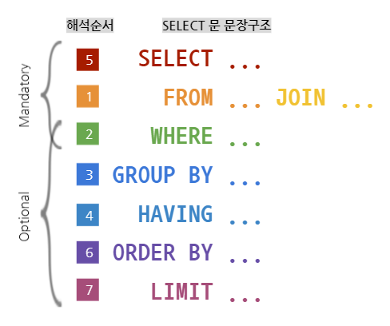

## 문장 구조화 하기 (_Statement Structure_)

SQL 문법에 정의된 키워드들과 앞서의 명명 규칙에 의해서 지어진 이름들을 사용하여 각 구절을 기술하고 이를 블럭처럼 쌓아 문장으로 구조화해 보도록 한다.

SQL에서 가장 중심이 되는 **SELECT** 문은 아래와 같은 구조를 갖는다.

  

- SELECT 리스트 절
- FROM 절
- WHERE 절
- GROUP BY / HAVING / ORDER BY/ 절
- 

